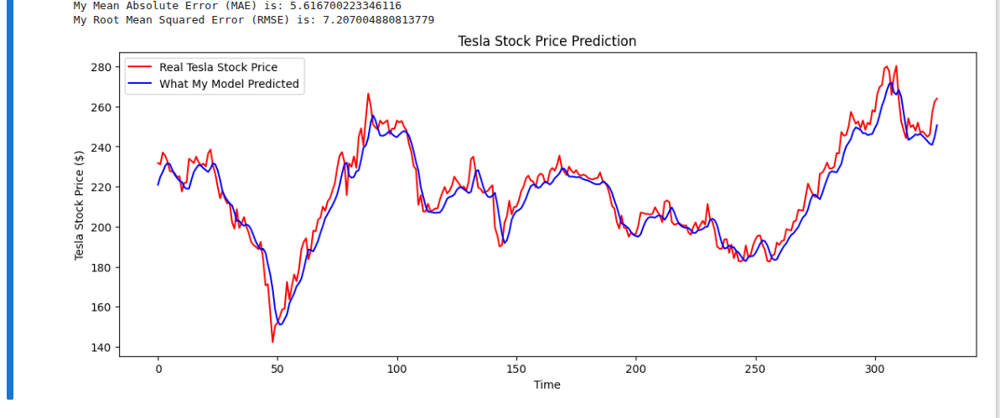

# Day 2 - Predicting Tesla Stock Prices with RNNs - Aman

This project is my hands-on exercise to dive into the world of Recurrent Neural Networks (RNNs). My goal was to build and train an LSTM model to see if I could predict the next-day opening price of Tesla's stock (TSLA) using historical data from Kaggle.

## My Project's Results: A Quick Look

After training my model, I plotted its predictions (in blue) against the actual stock prices (in red) for the test period. It was really cool to see how well the model managed to capture the overall trend of the stock price!

### Screenshot of My Prediction Plot

*(This is where you should add a screenshot of the graph generated by the final cell of the notebook. It will look something like this.)*



As you can see, the predicted values follow the real values pretty closely, which tells me the model learned the basic patterns in the data.

---

## How to Get This Running on Your Machine

If you want to run this project yourself, here’s how you can do it.

### 1. Prerequisites
Make sure you have Python 3.8+ installed on your system.

### 2. Setup
First, clone this repository to your local machine.

```bash
git clone https://github.com/Amaninreal/pi-shaped-deep-learning-Aman.git
cd pi-shaped-deep-learning-Aman
```


```bash
python -m venv my-rnn-env
source ~/jupyter-env/bin/activate ( my virtual env)
```

Then, install all the necessary libraries.

```bash
pip install -r requirements.txt
```
```
pandas
scikit-learn
tensorflow
matplotlib
numpy
```

### 3. Get the Dataset
Download the Tesla Stock Data from Kaggle: [Tesla Stock Data (TSLA)](https://www.kaggle.com/datasets/rpaguirregabiria/tesla-stock-data-updated-till-2023)


### 4. Run the Code
Now you're all set! Just launch Jupyter Notebook or JupyterLab and open the `.ipynb` file to run the code cell by cell.

```bash
jupyter notebook
```

---

## My Answers to Core Concept Questions

During this exercise, I had to think about a few key ideas. Here are my thoughts on them.

#### What's the big deal with using RNNs (or LSTMs) for time-series data?
The main reason I'd pick an RNN or LSTM for time-series stuff over a regular old neural network is all about "memory." A standard feedforward network treats every input as a brand new, isolated event. But with stock prices, today's price is obviously related to yesterday's. RNNs have a feedback loop that lets them pass information from one step to the next. This gives them a form of memory, allowing them to understand context and sequence, which is absolutely essential for time-series data.

#### Why is making those input "windows" so important?
I had to turn my time-series data into these little input windows for a simple reason: that's how I can frame it as a supervised learning problem. A model needs a clear "X" (input) and "y" (output). By creating windows, I'm explicitly telling the model, "Given these last 60 days of prices (X), I want you to learn to predict the price for the very next day (y)." Without this framing, the model would have no idea what it's supposed to be learning from or what it's supposed to predict.

#### How does scaling the data actually help my RNN/LSTM model?
Think of it this way: if I fed the raw stock prices (which can be hundreds of dollars) into my model, the numbers inside the network could get really big, really fast. This can make the training process unstable and slow. By scaling everything down to a tiny range like 0 to 1, I'm making the math much easier for the model. It helps the training process converge smoothly and ensures that the model doesn't get thrown off by the sheer magnitude of the numbers.

#### What's the difference between a SimpleRNN and an LSTM for long-term patterns?
A SimpleRNN has a very basic memory, but it's kind of like a person with short-term memory loss. It struggles to remember things that happened a long time ago in a sequence because of a technical problem called the "vanishing gradient." An LSTM is a more advanced version designed to fix this. It has a special system of "gates" (a forget gate, an input gate, and an output gate) that act like a bouncer for its memory. These gates let it carefully control what information to keep and what to throw away, which makes it way better at capturing long-term dependencies in the data.

#### Which metrics like MAE or RMSE are good for this, and why?
For predicting a number like a stock price, I need regression metrics.
*   **MAE (Mean Absolute Error):** This is the average of the absolute differences between my predictions and the real values. It's easy to understand because it's in the same unit as the stock price. For example, an MAE of 5 means my predictions are, on average, $5 off.
*   **RMSE (Root Mean Squared Error):** This one is a bit more complex. It squares the errors before averaging them and then takes the square root. The main effect of this is that it penalizes large errors much more than small ones. So, if my model makes a few really bad predictions, my RMSE will be high.

#### How can I tell if my model is overfitting?
Overfitting is like when you memorize the answers for a test but don't actually understand the concepts. My model might get really good at predicting the training data but fail completely on new data. The main way I check for this is by looking at the training loss versus the validation loss during training. If my training loss keeps going down but my validation loss flattens out or starts to go up, that's a huge red flag for overfitting.

#### How could I make this model even better?
There are a bunch of things I could try next:
*   **Add More Features:** I only used the 'Open' price. I could probably get better results by including the 'High', 'Low', 'Close', and 'Volume' data.
*   **Build a Deeper Network:** I could try stacking more LSTM layers or adding more neurons to each layer to let the model learn more complex patterns.
*   **Tune Hyperparameters:** I could experiment with things like the sequence length, the learning rate, or the batch size to find the optimal settings.

#### Why is it so important *not* to shuffle sequential data?
Think about it like reading a book. If you shuffle all the pages, the story makes no sense. It's the same with time-series data. The order of events *is* the story. My model needs to learn the sequence—that this day follows the previous one. Shuffling destroys that sequence, and the model can't learn the temporal patterns. So for time-series, keeping the data in its original chronological order is non-negotiable.

#### How can I visualize the results to see how my model performed?
For me, the best way is to plot the results on a line graph. I plot the real stock prices over time as one line and my model's predictions as another line on the same graph. This way, I can see at a glance how closely my predictions follow the actual movements of the stock. It's a very intuitive way to judge performance.

#### What are the real-world problems with using RNNs for stock prediction?
Predicting stocks in the real world is incredibly hard, and my simple model has limitations.
*   **Randomness and News:** The market is super volatile and can be swayed by news events (like a tweet from the CEO or a new government policy) that my model has no way of knowing about from historical price data alone.
*   **The Market Changes:** The patterns that worked in the past might not work in the future. The market is "non-stationary," meaning its statistical properties are always changing.
*   **It's a Trap!** It's really easy to build a model that just predicts that tomorrow's price will be very close to today's price. While that might look accurate on a graph, it's not actually useful for making trading decisions.