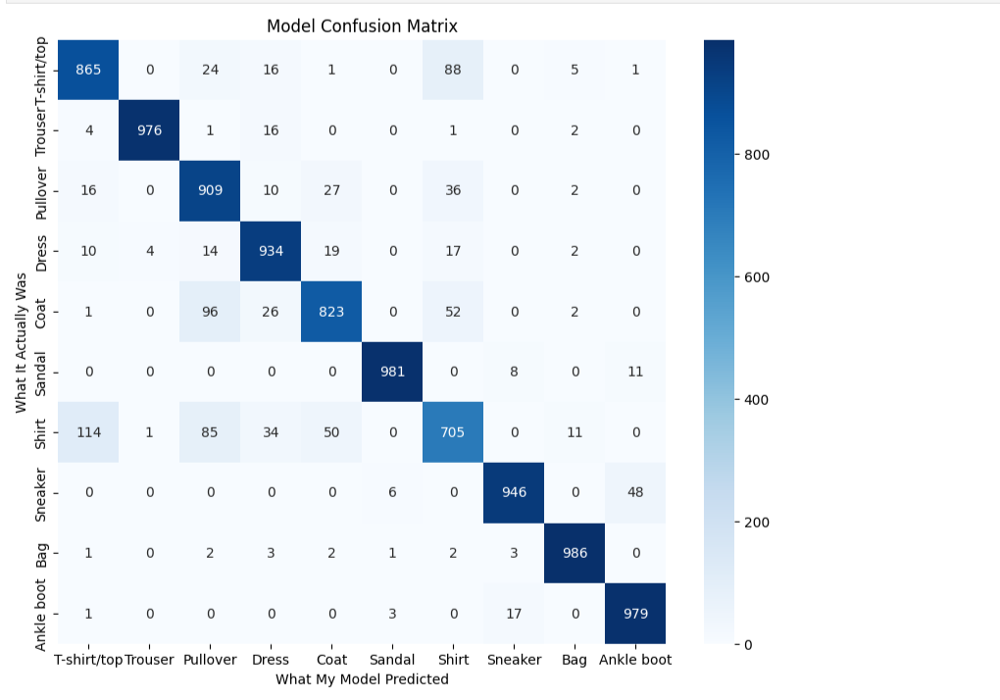

# Day 3 - Fashion-MNIST Image Classification using a CNN ( Aman )

This project is a hands-on exercise to build, train, and evaluate a Convolutional Neural Network (CNN). The goal is to create a model that can accurately classify images from the Fashion-MNIST dataset into one of 10 different fashion categories.

## Project Objective

- **Load and Preprocess** the Fashion-MNIST image dataset.
- **Build a simple CNN** architecture from scratch using TensorFlow and Keras.
- **Compile and Train** the model on the training data.
- **Evaluate** the trained model's performance on unseen test data using key metrics like accuracy and a confusion matrix.
- **Explain** the core concepts behind the technologies used.

---

### Screenshot of My Prediction Plot



## How to Run This Project

### Prerequisites

You will need Python 3 and the following libraries installed. You can install them using pip:

```bash
pip install tensorflow numpy matplotlib seaborn scikit-learn
```

### Execution

1.  **Clone the Repository:**
    ```bash
    git clone https://github.com/Amaninreal/pi-shaped-deep-learning-Aman.git
    ```
    ```bash
    cd pi-shaped-deep-learning-Aman
    ```
3.  **Run the Jupyter Notebook:**
    Open the `day3_fashion_mnist.ipynb` file in Jupyter Lab or Jupyter Notebook and run the cells from top to bottom.

---

## Model Performance

The final model achieved a test accuracy of approximately **90-91%**.

The confusion matrix revealed that the model is very confident in classifying distinct items like **Trousers**, **Bags**, and **Ankle boots**. The primary sources of confusion occurred between visually similar items, such as:
- **Shirt** vs. **T-shirt/top**
- **Pullover** vs. **Coat**

This is an expected challenge, as these items share many visual features.

---

## Core Concept Questions & My Understanding

Here are my explanations for the fundamental concepts behind this project.

### 1. What advantages do CNNs have over traditional fully connected neural networks for image data?

In my words, a traditional network treats an image as just a long list of pixels, losing the spatial context of where those pixels are. It doesn't know that one pixel is *next to* another. A CNN is much smarter; it uses sliding filters to look at small local regions of an image. This allows it to learn specific patterns (like an edge, a curve, or a texture) and recognize that pattern no matter where it appears in the image. This makes it far more efficient and effective for image tasks.

> **Case Study: Facial Recognition System**
> A traditional network would have to learn the pattern of an "eye" in the top-left, top-right, and center of an image as three completely separate things. A CNN learns a single "eye detector" filter and can find an eye *wherever* it is, making it vastly more robust.

### 2. What is the role of convolutional filters/kernels in a CNN?

I think of filters as specialized "pattern detectors." Each filter is a tiny grid of numbers trained to find one specific feature. Early filters might learn to detect simple things like vertical lines or green patches. Deeper in the network, filters learn to combine these simple patterns to detect more complex things, like a "car wheel" or an "eyebrow."

> **Case Study: Medical Imaging for Tumor Detection**
> In a CNN analyzing MRI scans, an early-layer filter might become an expert at detecting subtle changes in tissue texture. A deeper-layer filter could then learn to combine these texture maps with shape information to identify the specific pattern of a malignant tumor, distinguishing it from healthy tissue.

### 3. Why do we use pooling layers, and what is the difference between MaxPooling and AveragePooling?

Pooling layers are used to shrink the image data down as it passes through the network. This does two great things: it makes the network faster (fewer calculations) and helps prevent overfitting by summarizing features in a local region, making the model less sensitive to the exact location of a feature.

-   **MaxPooling** is like the "highlight reel." It looks at a small area and keeps only the single most important (highest value) pixel, preserving the sharpest features.
-   **AveragePooling** is the "general impression." It takes the average value of all pixels in the area, creating a smoother summary.

> **Case Study: Animal Classifier**
> When identifying a zebra, **MaxPooling** would be excellent at preserving the sharpest, most distinct edge of a black stripe against a white stripe—a key feature. **AveragePooling** might blur this edge slightly but could be useful for summarizing the overall texture of the animal's fur.

### 4. Why is normalization of image pixels important before training?

Normalization is about making sure the network can learn effectively. Pixel values range from 0 to 255. Feeding such large numbers into a network can make the training process unstable and slow. By scaling everything to a small, consistent range like 0 to 1, we ensure that the learning process is smooth and fast.

> **Case Study: Art Style Classifier**
> If a model is classifying paintings, a very bright painting (high pixel values) could unfairly dominate the learning process compared to a dark one (low values). By normalizing both, the network can focus on the *patterns* of the brush strokes, not just the overall brightness.

### 5. How does the softmax activation function work in multi-class classification?

Softmax is the final decision-maker. After the network has processed an image, the last layer produces a set of raw scores for each class. Softmax takes this messy list of scores and converts it into a clean list of probabilities that all add up to 100%. The class with the highest probability is the model's final prediction.

> **Case Study: Document Scanner App**
> An app classifies a document as "Invoice," "Contract," or "Letter." The network outputs raw scores: `{Invoice: 18.2, Contract: 15.1, Letter: 4.5}`. Softmax converts these into probabilities: `{Invoice: 94.6%, Contract: 5.3%, Letter: 0.1%}`. Now the app can confidently tag the document as an "Invoice."

### 6. What strategies can help prevent overfitting in CNNs? (e.g., dropout, data augmentation)

Overfitting is when a model just memorizes the training data and can't handle new, unseen data. Two great strategies to prevent this are:

-   **Dropout**: During training, you randomly "turn off" some neurons. This forces the other neurons to learn more robustly instead of relying on a few over-specialized ones.
-   **Data Augmentation**: You create more training data by taking your existing images and slightly changing them—rotating, zooming, or flipping them.

> **Case Study: Self-Driving Car's Stop Sign Detector**
> An overfit model might only recognize a perfectly lit stop sign. By using **data augmentation** (showing it rotated, faded, or partially obscured signs) and **dropout** (ensuring the whole network contributes to the decision), the model becomes far more reliable in the real world.

### 7. What does the confusion matrix tell you about model performance?

A confusion matrix is a detailed report card. An accuracy score of 90% tells you what you got right, but the confusion matrix tells you *what you got wrong*. It shows exactly which classes the model is getting confused about (e.g., frequently mistaking "Shirts" for "T-shirts"). This is essential for understanding the model's specific weaknesses.

> **Case Study: Email Spam Filter**
> A confusion matrix can tell a developer that their filter is great at catching obvious spam, but it frequently mislabels promotional newsletters (False Positives) or misses sophisticated phishing emails (False Negatives). This allows them to focus their efforts on fixing those specific problems.

### 8. If you wanted to improve the CNN, what architectural or data changes would you try?

To improve my model, I would focus on two areas:

1.  **Architectural Changes**: I would make the network "deeper" by adding another `Conv2D` and `MaxPooling2D` layer. This would allow it to learn more intricate details. I would also add `Dropout` layers to prevent overfitting as the model gets more complex.
2.  **Data Changes**: The best way to improve a model is often with more data. Since I can't get more images, I would use **data augmentation** heavily to create a larger, more diverse training set by rotating, shifting, and zooming the existing images.