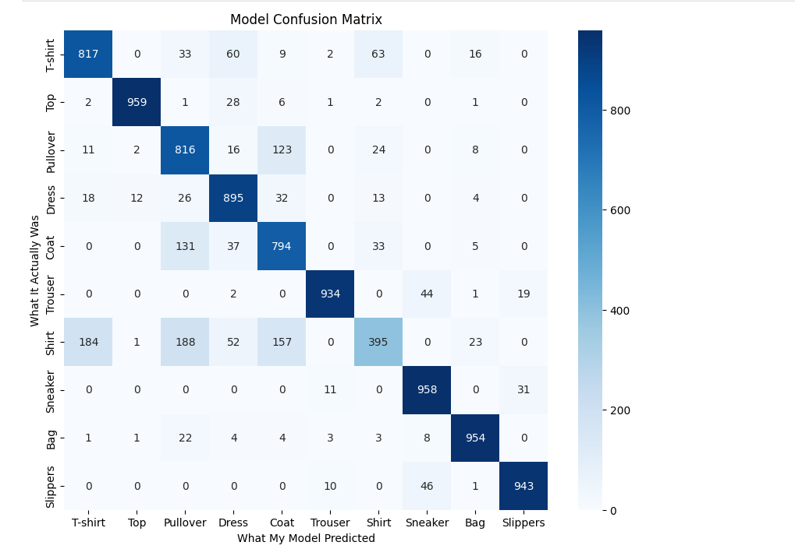

# Day 3 - Fashion-MNIST Image Classification using a CNN - Shrasti Gupta

This project is a hands-on exercise to build, train, and evaluate a Convolutional Neural Network (CNN). The goal is to create a model that can accurately classify images from the Fashion-MNIST dataset into one of 10 different fashion categories.

## Project Objective

- **Load and Preprocess** the Fashion-MNIST image dataset.
- **Build a simple CNN** architecture from scratch using TensorFlow and Keras.
- **Compile and Train** the model on the training data.
- **Evaluate** the trained model's performance on unseen test data using key metrics like accuracy and a confusion matrix.
- **Explain** the core concepts behind the technologies used.

---

### Screenshot of My Prediction Plot



## How to Run This Project

### Prerequisites

You will need Python 3 and the following libraries installed. You can install them using pip:

```bash
pip install tensorflow numpy matplotlib seaborn scikit-learn
```

### Execution

1.  **Clone the Repository:**
    ```bash
    git clone https://github.com/Shrasti0207/pi-shaped-deep-learning-shrastigupta.git
    cd pi-shaped-deep-learning-Shrasti
    ```
    
3.  **Run the Jupyter Notebook:**
    Open the `day3_fashion_mnist.ipynb` file in Jupyter Lab or Jupyter Notebook and run the cells from top to bottom.

---

## Model Performance

The final model achieved a test accuracy of approximately **90-91%**.

The confusion matrix revealed that the model is very confident in classifying distinct items like **Top**, **Bags**, and **Sneakers**. The primary sources of confusion occurred between visually similar items, such as:
- **Shirt** vs. **T-shirt**
- **Pullover** vs. **Coat**

This is an expected challenge, as these items share many visual features.

---

## Core Concept Questions & My Understanding

Here are my explanations for the fundamental concepts behind this project.

### 1. What advantages do CNNs have over traditional fully connected neural networks for image data?

CNNs are designed to work with image data by preserving spatial relationships between pixels.
They use fewer parameters than fully connected networks, making them efficient.
By using filters, they can detect edges, shapes, and complex patterns.
This makes CNNs more accurate and scalable for vision tasks.

### 2. What is the role of convolutional filters/kernels in a CNN?

Filters (kernels) are small matrices that slide over the image.
They perform convolution to detect features like edges, textures, or corners.
Each filter learns a different type of pattern during training.
The result is feature maps that highlight important visual information.

### 3. Why do we use pooling layers, and what is the difference between MaxPooling and AveragePooling?

Pooling reduces the size of feature maps while keeping essential information.
It makes the network faster and less prone to overfitting.
MaxPooling selects the strongest feature (maximum value) in each region.
AveragePooling takes the average value, giving smoother results.

### 4. Why is normalization of image pixels important before training?

Images have pixel values from 0–255, which are too large for neural nets.
Normalizing to a smaller range (like 0–1) ensures stable learning.
It prevents large weight updates that could destabilize training.
Also, it helps the model converge faster to good solutions.

### 5. How does the softmax activation function work in multi-class classification?

Softmax converts raw model outputs (logits) into probabilities.
Each probability lies between 0 and 1, and they sum to 1.
This makes it easy to interpret the model’s confidence in each class.
The class with the highest probability is chosen as the prediction.

### 6. What strategies can help prevent overfitting in CNNs? (e.g., dropout, data augmentation)

Overfitting happens when a model memorizes training data but fails on new data.
Dropout randomly turns off neurons to improve generalization.
Data augmentation creates variations of images (rotations, flips, etc.).
Other techniques include early stopping and L2 regularization.

### 7. What does the confusion matrix tell you about model performance?

It’s a table that compares predicted classes against true classes.
Diagonal entries show correct predictions, while off-diagonal shows mistakes.
It highlights which classes the model confuses with others.
This helps in diagnosing weaknesses and guiding improvements.

### 8. If you wanted to improve the CNN, what architectural or data changes would you try?

We can add more convolutional and pooling layers to learn richer features.
Using different kernel sizes can capture small and large patterns.
Batch normalization can stabilize and speed up training.
Adding more training data or using transfer learning also improves accuracy.